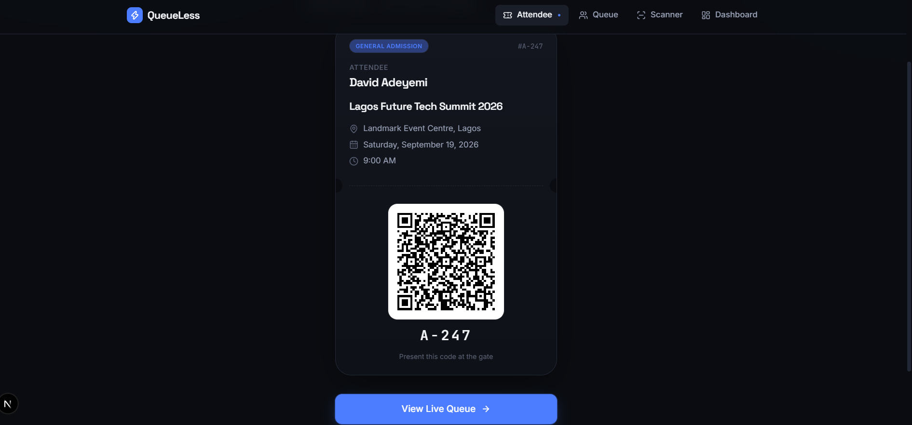
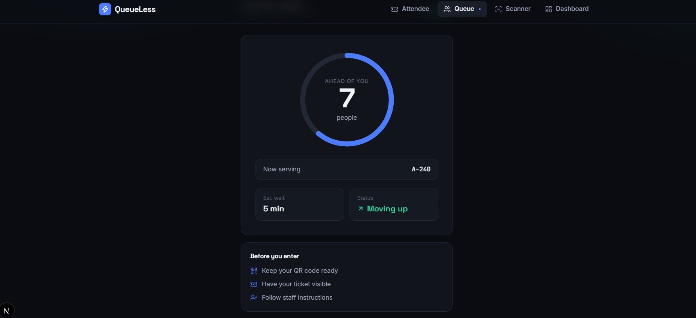
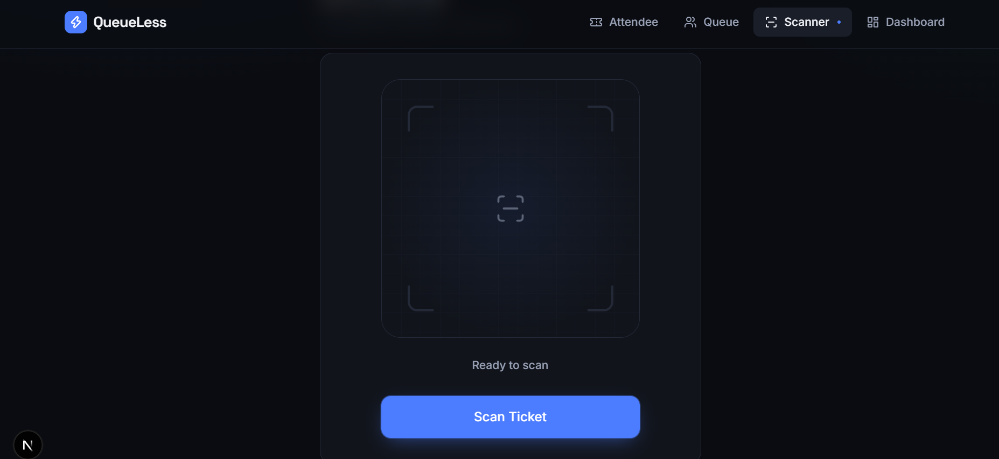
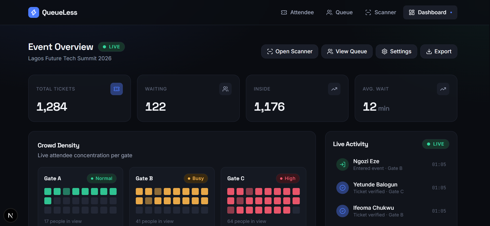

# QueueLess

### Skip the queue. Keep moving.

QueueLess is a modern QR-based event entry and queue management system designed to make crowded event entrances faster, more organized, and easier to monitor.

It provides attendees with digital tickets and queue information while giving event staff real-time visibility into ticket verification, waiting attendees, crowd density, and event activity.

> **Current status:** Frontend-focused prototype with mock event data and client-side interactions. No backend, authentication, or real-time server infrastructure yet.

## 📸 Screenshots

### Attendee Ticket


### Queue Management


### Ticket Scanner


### Admin Dashboard


## ✨ Features

- 🎟️ Digital event tickets
- 📱 QR-based ticket verification
- 🔍 Ticket scanning interface
- 🔢 Real-time queue number display
- 👥 Queue monitoring
- 📊 Event operations dashboard
- 🚦 Crowd density monitoring by gate
- ⚡ Live activity feed
- 📈 Event attendance overview
- 📝 Event feedback experience
- 📱 Responsive layouts
- 🌙 Dark event-operations interface
- 🎞️ Motion-focused interaction design
- ⚡ Fast navigation with Next.js App Router

## 🎯 Core Experience

### Attendee

Attendees can:

- Access their digital event ticket
- View their unique ticket number
- Display their QR code at the entrance
- Monitor their queue position
- See event information
- Submit event feedback

### Event Staff

Staff can:

- Open the QR scanner
- Verify attendee tickets
- Monitor the current queue
- Track people waiting to enter
- View live entry activity
- Monitor crowd density across different gates

### Event Administrator

Administrators can:

- Monitor total tickets
- Track attendees waiting
- Track attendees already inside
- View average waiting time
- Monitor gate crowd density
- View live event activity
- Access event operations from a centralized dashboard

## 🖥️ Main Screens

### Attendee Ticket

A digital event ticket containing:

- Attendee information
- Event information
- Venue
- Date and time
- Ticket type
- Unique ticket number
- QR code

### Queue

A queue-focused interface designed to communicate the attendee's position clearly and reduce uncertainty while waiting.

### Scanner

A fast QR scanning interface designed for event staff at entry gates.

### Admin Dashboard

A real-time event overview showing:

- Total tickets
- Waiting attendees
- Attendees inside
- Average waiting time
- Crowd density
- Gate status
- Live activity

## 🎨 UX & Design Focus

QueueLess is designed around **speed perception**.

The interface prioritizes:

- Clear visual hierarchy
- Large, readable queue information
- Immediate feedback
- Minimal interaction steps
- Status-based color communication
- Motion and transition cues
- Fast navigation
- High-contrast event operations UI

The goal is to make both attendees and event staff feel that the entry process is moving quickly and predictably.

## 🛠 Tech Stack

- **Next.js 16** — App Router
- **TypeScript** — strict type checking
- **Tailwind CSS v4** — styling
- **Radix UI** — accessible UI primitives
- **Lucide React** — interface icons
- **Motion** — interaction and animation
- **QR Code tooling** — digital ticket and scanning experience

## 📂 Project Structure

```text
src/
├── app/
│   ├── admin/              # Organizer dashboard
│   ├── queue/              # Attendee queue tracking
│   ├── scanner/            # QR ticket scanner
│   ├── ticket/             # Digital attendee ticket
│   ├── globals.css         # Global styles
│   └── layout.tsx          # Root application layout
│
├── components/             # Reusable UI components
├── data/                    # Mock events, tickets and attendee data
├── hooks/                   # Custom React hooks
├── lib/                     # Shared utilities and application logic
└── types/                   # Shared TypeScript types
```

## 🧠 Important Architecture Decisions

QueueLess is structured as a frontend-first application so the interface and core user flows can be developed independently of the backend.

### Component-based UI

Reusable interface elements are separated into components to keep pages clean and make the design system easier to maintain.

### Centralized application logic

Shared calculations, formatting, and utility functions live inside the `lib` directory rather than being duplicated across pages.

### Mock data layer

Event, attendee, ticket, queue, and crowd data are kept separately from the UI. This makes it easier to replace the prototype data with a real API or database later.

### Route-based experiences

Each major QueueLess experience has its own route, allowing the attendee and organizer workflows to remain independent while sharing the same design system.

### Frontend-first architecture

The current version focuses on interaction design, responsive layouts, queue visibility, QR ticket presentation, and perceived speed. Backend services can be introduced without redesigning the core interface.

## 🚀 Getting Started

### Prerequisites

Make sure you have Node.js installed on your machine.

### Installation

Clone the repository:

```bash
git clone https://github.com/MAJESTY111/queueless.git
```

Move into the project directory:

```bash
cd queueless
```

Install the dependencies:

```bash
npm install
```

Start the development server:

```bash
npm run dev
```

Open the application in your browser:

```text
http://localhost:3000
```

## 🗺️ Application Routes

| Route | Description |
|---|---|
| `/ticket` | Displays the attendee's digital event ticket and QR code |
| `/queue` | Shows the attendee's current queue position and waiting information |
| `/scanner` | Provides the event staff ticket-scanning interface |
| `/admin` | Displays event statistics, queue activity, and crowd density |

## 👤 Attendee Experience

The attendee flow is designed to minimize uncertainty while waiting to enter an event.

1. Receive a digital ticket.
2. Open the ticket on a mobile device.
3. Present the QR code at the entrance.
4. Have the ticket verified by event staff.
5. Track queue progress in real time.
6. Enter the event when their position is reached.

The interface prioritizes large readable information, clear status indicators, and minimal interaction so attendees can understand their current state at a glance.

## 🎟️ QR Ticket System

Each attendee receives a digital ticket containing event information and a QR code.

The ticket interface includes:

- Attendee name
- Ticket type
- Ticket reference
- Event name
- Event location
- Event date and time
- QR code for entry verification

The current QR workflow is implemented as a frontend prototype and is prepared for integration with a production scanning service.

## 📊 Organizer Dashboard

The admin dashboard provides an overview of event entry activity.

It includes:

- Total tickets
- People currently waiting
- Attendees already inside
- Average waiting time
- Crowd density by gate
- Live entry activity
- Queue monitoring
- Scanner access
- Event settings
- Data export controls

The dashboard is designed to help organizers identify crowded entry points and understand how quickly attendees are moving through the event.

## 🚶 Queue Management

QueueLess replaces traditional physical waiting lines with a digital queue experience.

Instead of standing in a fixed line, attendees can monitor their position and waiting status from their device.

The interface is designed around three principles:

- **Clarity** — users should immediately understand where they are in the queue.
- **Speed perception** — motion and live updates make progress feel visible.
- **Low friction** — users should not need to repeatedly refresh or navigate through multiple screens.

## 👥 Crowd Density

The organizer dashboard provides a visual representation of attendee concentration across different entry gates.

Each gate can display a different crowd state:

- **Normal** — low or manageable crowd
- **Busy** — increased attendee concentration
- **High** — potentially congested entry point

This allows event staff to identify problem areas quickly and redirect attendees when necessary.

## ⚡ Interaction & Motion Design

QueueLess places particular emphasis on interaction design and perceived speed.

The interface uses:

- Lightweight transitions
- Immediate visual feedback
- Status indicators
- Animated queue progression
- Responsive controls
- Clear loading and verification states
- Minimal navigation friction

The goal is not simply to make the application functional, but to make the process of entering a crowded event **feel faster and more organized**.

## 📱 Responsive Design

QueueLess is designed for different screen sizes and usage environments.

The attendee experience prioritizes mobile devices because tickets and queue information are most likely to be accessed while users are moving through an event.

The organizer dashboard is optimized for larger screens where staff need to monitor multiple pieces of information simultaneously.

## ⚠️ Current Limitations

QueueLess is currently a frontend-focused prototype.

The following features are not yet connected to production infrastructure:

- Backend database
- User authentication
- Role-based permissions
- Real-time WebSocket communication
- Production QR ticket validation
- Persistent attendee records
- Live crowd sensors
- Payment processing
- Production event management
- Automated notifications
- Production analytics

The current application uses mock data to demonstrate the intended product experience.

## 🔮 Future Development

The next stage of QueueLess could introduce:

### Backend & Infrastructure

- REST or GraphQL API
- PostgreSQL or another production database
- Secure authentication
- Role-based access control
- Event and ticket management

### Real-time Queue

- WebSocket-based queue updates
- Live attendee position changes
- Automatic queue notifications
- Estimated waiting times
- Gate-specific queue management

### Ticketing

- Production QR code generation
- Secure QR verification
- Ticket purchasing
- Payment integration
- Email ticket delivery
- WhatsApp ticket delivery

### Event Operations

- Multiple events
- Multiple venues
- Multiple entry gates
- Staff accounts
- Gate assignment
- Event capacity controls
- Attendance analytics

### Crowd Management

- Live crowd-density data
- Gate congestion alerts
- Capacity warnings
- Historical crowd analytics
- Entry-rate monitoring

### Attendee Feedback

- Post-event feedback forms
- Ratings and reviews
- Organizer analytics
- Satisfaction tracking

## 🎯 Product Vision

QueueLess aims to make event entry feel as simple and predictable as checking in online.

Traditional event queues create uncertainty. Attendees do not know how long they will wait, how quickly the line is moving, or whether another entrance would be faster.

QueueLess changes that experience by giving attendees a digital ticket, a visible queue position, and clearer information about their entry.

For organizers, QueueLess provides visibility into the movement of people through event entrances so staff can respond to congestion before it becomes a major problem.

The long-term vision is to create a flexible queue-management platform that can support:

- Concerts
- Conferences
- Church programs
- Government offices
- Universities
- Campuses
- Hospitals
- Public events
- High-traffic venues

**Skip the queue. Keep moving.**

## 📄 License

This project is currently a portfolio and product prototype.

All rights reserved unless otherwise stated.